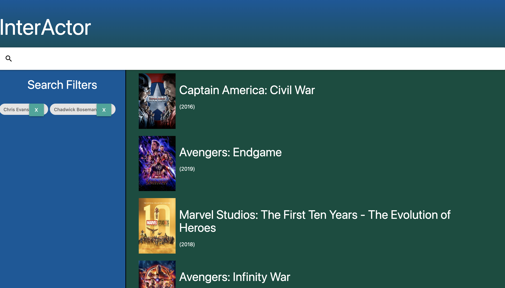

# InterActor - (GroupProject 1)

# This is the submission for Group Project #1 [InterActor] (https://github.com/Allout004/GroupProject1) for U/W Coding Bootcamp Full Stack Flex Program, for Kurt Heimerman.

## Notes About Application:      
* Looks for 2 or more actors/actresses in the same movie

## The deployed app is here:  https://allout004.github.io/GroupProject1/

## It uses HTML, CSS, Materialize, Web-API fetch, Javascript, Jquery and TMDB API.

